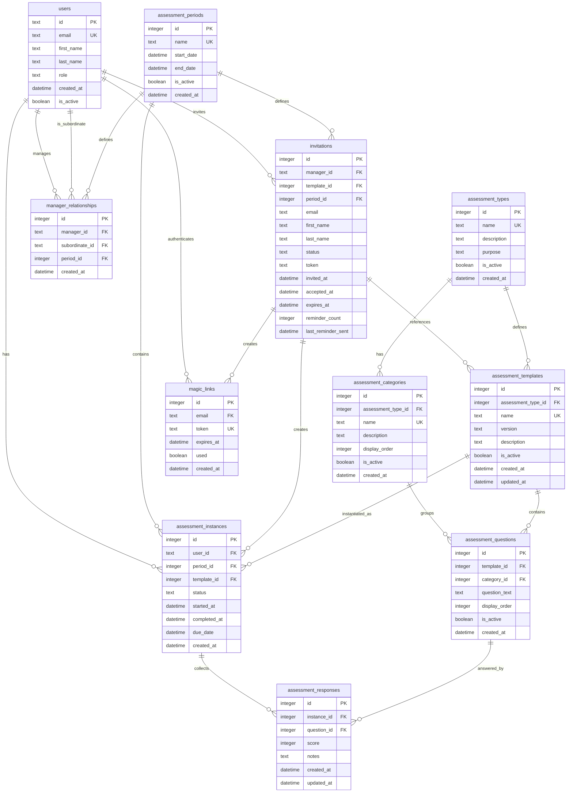

# Assessment Tracker - Database Schema

## Complete Database Schema Diagram

## Key Design Principles

### **Template System**
- **Assessment Templates** are collections of questions organized by categories
- Each template belongs to an assessment type (Manager Self-Assessment, Team Member Assessment, Director's MRI)
- Templates can be versioned - new versions become new templates, old versions retain their instances
- Questions are organized by categories within each template

### **Instance System**
- **Assessment Instances** link a specific user to a specific template for a specific period
- Each instance gets its own set of response records
- Instances track completion status and timing

### **Response System**
- **Assessment Responses** store individual answers to questions
- Each response links to both the instance and the specific question
- Responses include the 1-7 score and optional notes

### **Invitation System**
- **Invitations** directly reference assessment templates and periods
- Managers can bulk-invite by providing names and emails
- System tracks invitation status and reminder history
- When invitations are accepted, assessment instances are created from the referenced template

### **Relationship System**
- **Manager Relationships** define who reports to whom in each period
- Relationships are period-specific to handle organizational changes
- Used to determine who can assess whom

## Sample Data Flow

1. **Admin creates** assessment types, categories, templates, and questions
2. **Manager invites** subordinates by providing names/emails and selecting templates
3. **System creates** invitations (linked to templates and periods)
4. **Subordinates accept** invitations → system creates assessment instances from templates
5. **Subordinates complete** assessments → responses stored per question
6. **System tracks** completion and sends reminders as needed
7. **Managers view** team completion status and results

## Template Versioning Strategy

- **New template versions** become new template records
- **Old templates** retain all their existing instances and invitations
- **Future invitations** reference the new template version
- **No FK updates** needed - each template version maintains its own relationships 